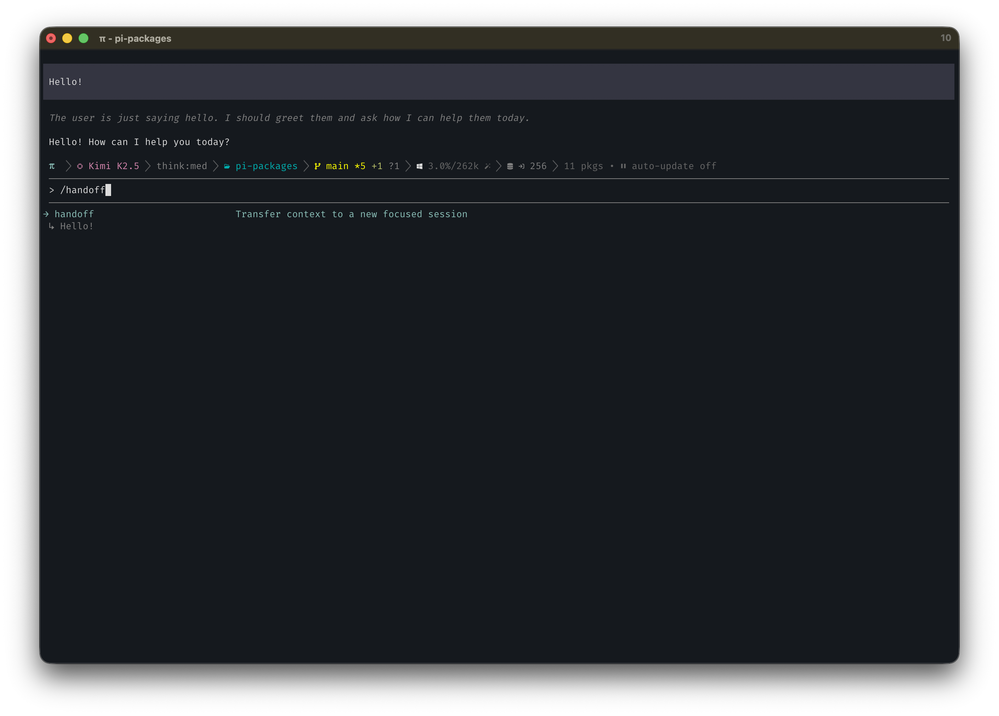

# pi-handoff



```bash
pi install @ssweens/pi-handoff
```

Context handoff extension for [pi](https://github.com/badlogic/pi-mono). Transfer context to a new session with a structured summary while preserving a durable repo-local recovery artifact.

> This standalone fork is derived from [ssweens/pi-packages/pi-handoff](https://github.com/ssweens/pi-packages/tree/main/pi-handoff). Its proactive threshold behavior was informed by [ttiimmaahh/pi-handoff](https://github.com/ttiimmaahh/pi-handoff), and its durable generate/validate/atomic-write/reread approach was informed by [bernardofortes/pi-session-continuity](https://github.com/bernardofortes/pi-session-continuity). These projects are MIT-licensed; this implementation is original and does not copy their code.

## Features

- **`/handoff <goal>`** — User-initiated context transfer to a focused new session
- **Agent-callable tool** — The model can initiate handoffs when explicitly asked
- **Proactive handoff** — At 80% context usage by default, prepares a handoff before Pi's normal autocompaction boundary
- **Auto-handoff on compaction** — Offers a handoff when Pi is already compacting
- **Durable artifacts** — Saves the exact handoff sent to the new session at `.pi/handoff.md` and archives each successful handoff under `.pi/handoffs/`
- **Parent session query** — `session_query` can look up details from prior sessions

## Configuration

Project-local configuration is read from `.pi/handoff.json`:

```json
{
  "handoffThreshold": 0.80,
  "persistHandoff": true,
  "handoffPath": ".pi/handoff.md",
  "archiveHandoffs": true
}
```

Defaults are `handoffThreshold: 0.80`, `persistHandoff: true`, `.pi/handoff.md`, and archive enabled. Threshold usage is calculated from Pi's authoritative `ctx.getContextUsage()` token count divided by its active context-window size; this extension adds no character-count estimate. Pi may itself estimate trailing-message tokens when no provider usage is available. If Pi cannot provide both values, the proactive trigger waits for a usable measurement.

## Handoff behavior

### Proactive threshold

The extension watches `turn_end`. The first turn whose measured usage reaches the configured threshold generates one handoff and schedules the normal fresh-session flow. It does not repeatedly prompt on later turns. The latch resets after a handoff, a proper new session, or a context compaction/reset.

This occurs before Pi's normal autocompaction so the model has more context available for a useful summary. It does not itself compact the old session.

### Manual and compaction handoffs

`/handoff <goal>` and the agent `handoff` tool retain the original Sweens UX: generate a structured summary, open a fresh session, place the editable prompt in the editor, and let the user press Enter. The compaction hook still offers handoff, compact, or continue. The outgoing session remains intact in all cases.

Pi **compaction** summarizes an earlier portion of the current session to keep working in that session. A **fresh-session handoff** creates a separate session with a focused prompt. The **durable handoff artifact** is the on-disk copy used to make that transition recoverable; it is not a replacement for either session operation.

### Durable persistence and failures

Before a handoff transition proceeds, the canonical prompt is:

1. generated once;
2. augmented with parent-session and file-operation context;
3. archived under `.pi/handoffs/` (when enabled);
4. written to a temporary file;
5. reread and verified;
6. atomically renamed to `.pi/handoff.md`; and
7. reread and verified again.

The editor may show compact file markers, but its input hook expands them to the same canonical text persisted on disk. If directory creation, writing, rename, rereading, or verification fails, the user sees an error, the old session is preserved, and no automatic transition is performed. Manual recovery remains available. Generated artifacts can contain sensitive context; keep `.pi/handoff.md` and `.pi/handoffs/` out of version control as appropriate.

## Parent sessions

Handoff prompts include a parent session reference and ancestor chain:

```text
/skill:pi-session-query

**Parent session:** `/path/to/old-session.jsonl`
```

The `session_query` tool can query those `.jsonl` files without loading the full conversation into the active session.

## License

MIT. See [LICENSE](LICENSE).
